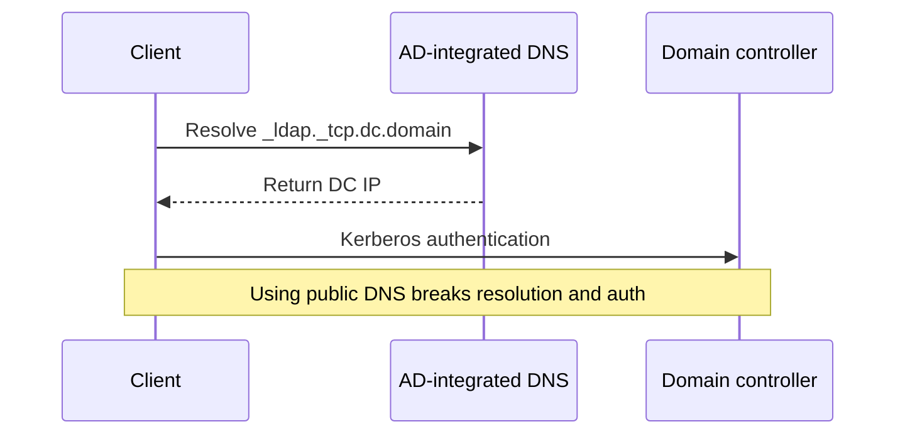
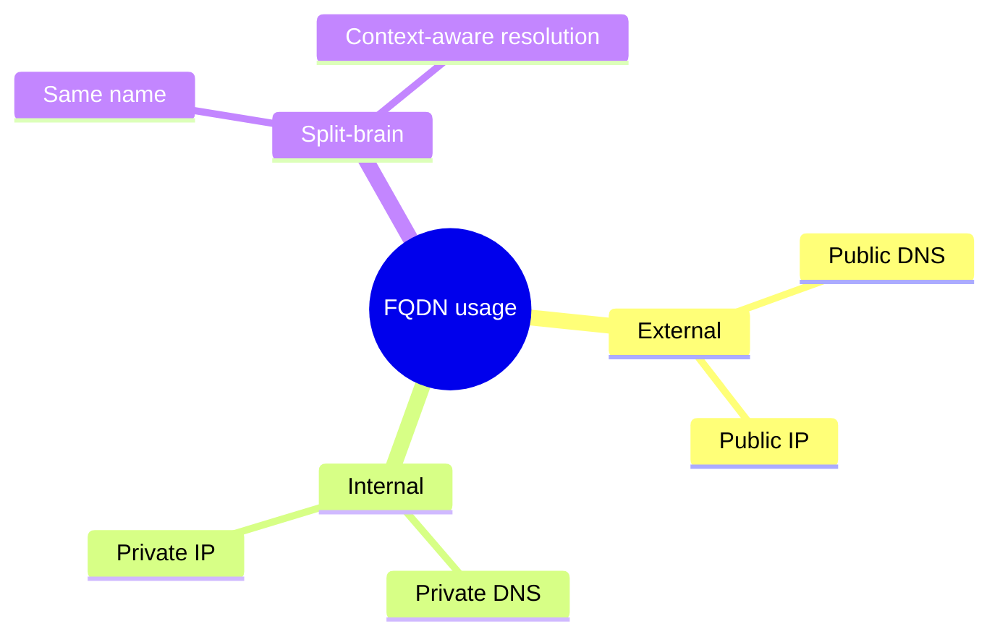

## Enterprise Identity and Device Management



### Active Directory (AD)

- Directory service managing users, computers, and resources; relies on LDAP for queries and Kerberos for auth.
- DNS dependency: domain controllers act as AD-integrated DNS servers; pointing clients to public DNS (e.g., 8.8.8.8) breaks authentication and policy delivery.
- macOS can bind to AD via Directory Utility for native logins.

### Kandji (Apple MDM)

```mermaid
flowchart LR
    ABM[Apple Business Manager (ADE)] --> Enrollment[Automatic enrollment]
    Enrollment --> Kandji[Kandji MDM]
    Kandji --> APNs[APNs]
    APNs --> Mac[Managed Mac]
    Kandji --> Agent[Kandji Agent]
    IdP[Cloud IdP] --> Kandji
    IdP --> Mac
```

- Cloud-based MDM that manages Macs using Apple’s native MDM protocol (not LDAP).
- Uses Apple Push Notification service (APNs) to trigger device check-ins.
- Automates enrollment via Apple Business Manager (ADE) on first boot; MDM profile enforces policies.
- Kandji Agent extends capabilities with software installs, scripts, and real-time compliance.

### Identity Provider Integration

- MDM governs devices; external IdP (Okta, Google Workspace, etc.) manages user identity and groups.
- Integration links user identity to device policies (e.g., deploy department-specific software).

### Fully Qualified Domain Names (FQDN)



- Complete DNS path like `host.domain.tld.`; unambiguous locator.
- **External FQDN:** Resolves public IP for internet access.
- **Internal FQDN:** Maps to private IP for internal services.
- **Split-brain DNS:** Same FQDN resolves to different IPs internally vs. externally.
