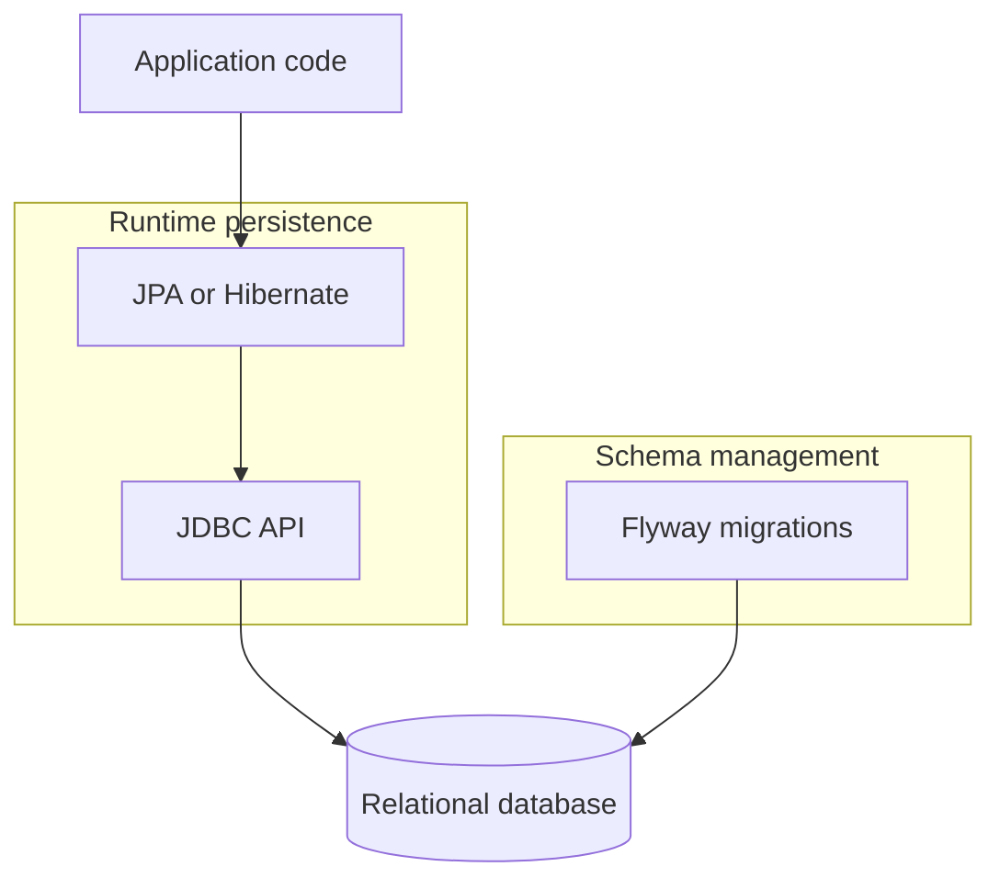

## Java, Maven, and Database Access Technologies

### Maven Dependency Management

```mermaid
flowchart TD
    A[Investigate build issue] --> B[mvn dependency:tree -pl target -Dincludes="group::*"]
    B --> C{Conflict found?}
    C -- Yes --> D[Add exclusion in dependency block]
    C -- No --> E[Reload IntelliJ Maven projects]
    D --> F[Re-run build with -am if needed]
    E --> F
    F --> G[Repository builds cleanly]
```

- Exclude conflicting artifacts inside a `<dependency>` block:

```xml
<dependency>
    <groupId>com.cloudera.thunderhead</groupId>
    <artifactId>thunderhead-services-common</artifactId>
    <version>${project.version}</version>
    <exclusions>
        <exclusion>
            <groupId>com.fasterxml.jackson.module</groupId>
            <artifactId>jackson-module-afterburner</artifactId>
        </exclusion>
    </exclusions>
</dependency>
```

- Use the `-am` flag to build the entire repo and reload all Maven projects in IntelliJ.

### Java Database Technologies Stack



- **JDBC:** Low-level, verbose Java API used for fundamental database access.
- **JPA / Hibernate:** High-level ORM that maps Java objects to tables and hides JDBC complexity.
- **Flyway:** Database migration tool that manages schemas with ordered scripts (e.g., `V1__Create_table.sql`).
- **Workflow:** Flyway builds the schema; JPA/Hibernate enables object-centric access; JDBC underpins everything.

### Serialization and JPA Errors

- Serializable classes must implement `Serializable` and define a `serialVersionUID` to avoid `InvalidClassException`.
- Watch for JPA transaction errors such as `No EntityManager with actual transaction available for current thread - cannot`.

### SQL Database Concepts

- **Composite Key:** `PRIMARY KEY (app_crn, instance_group_name)` creates a multi-column unique identifier.
- **JPA Composite Mapping:** Model composite keys with a separate `@Embeddable` class.
