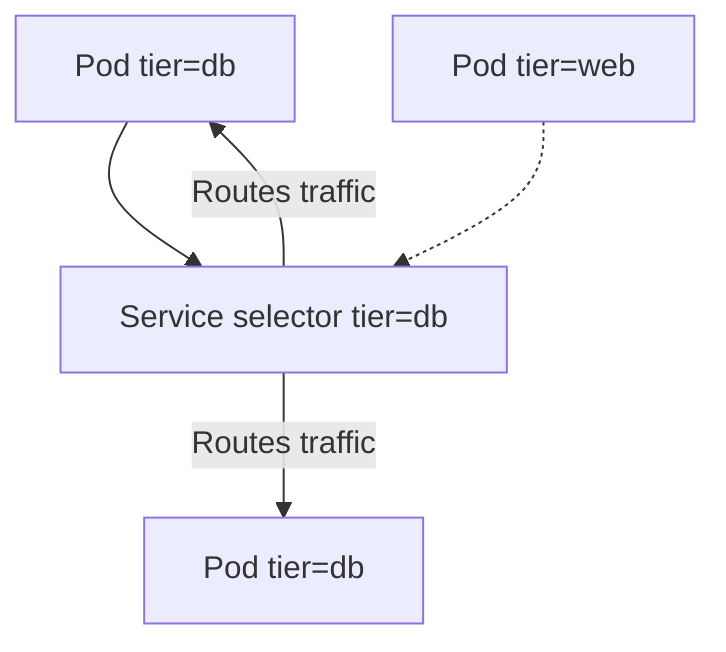
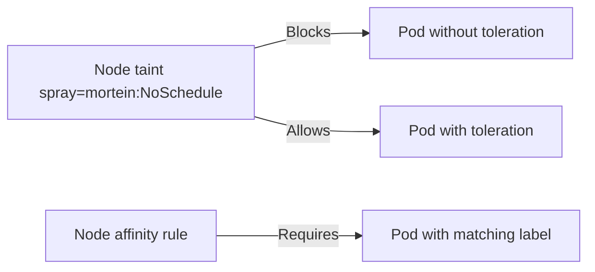
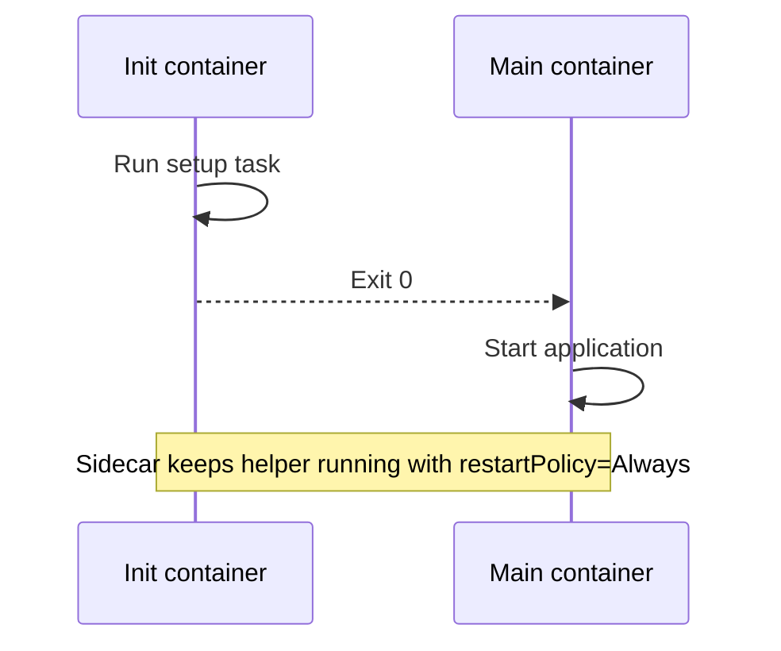
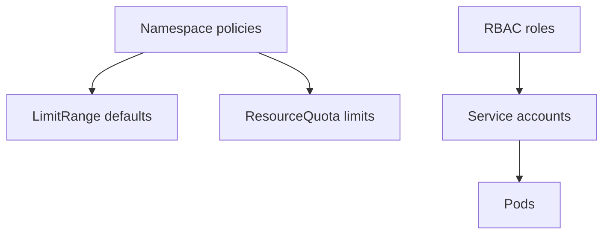
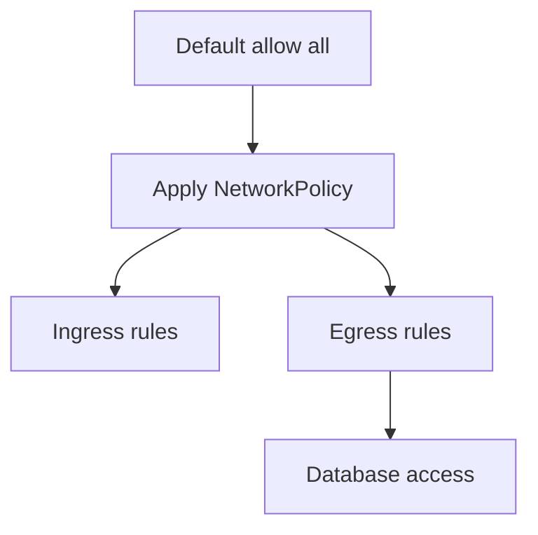
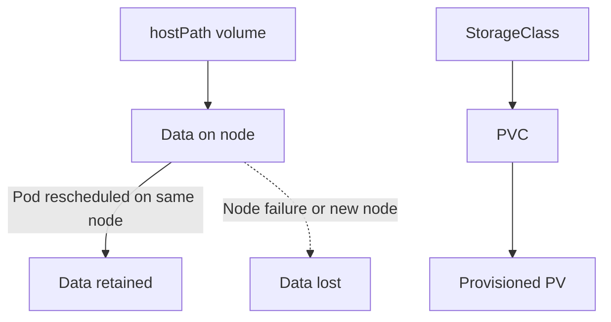
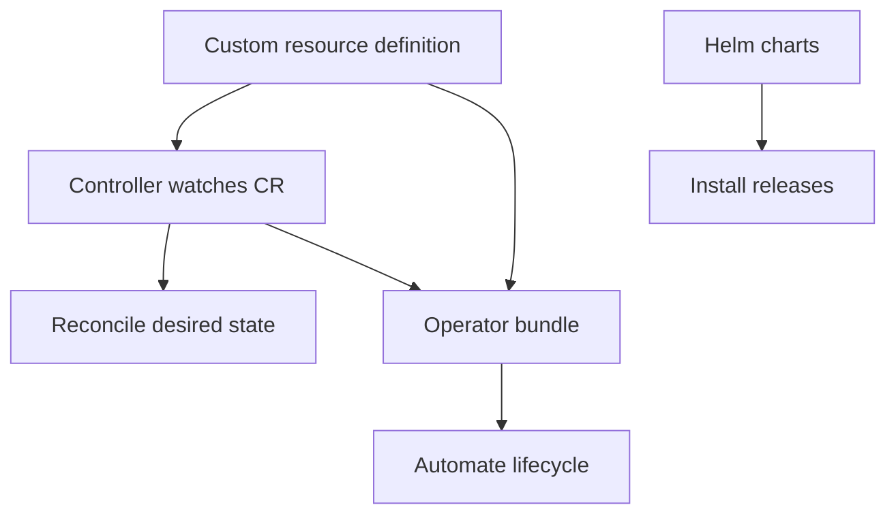

## Kubernetes Container Orchestration

```mermaid
flowchart LR
    Developer[Developer] -->|kubectl apply| APIServer[Kubernetes API server]
    APIServer --> ETCD[etcd (cluster state)]
    APIServer --> Scheduler[Scheduler]
    Scheduler --> Node[Worker node]
    Node --> Kubelet[Kubelet]
    Kubelet --> Containers[Managed containers]
```

### Architecture

- A cluster is a collection of nodes. The control plane (master node) orchestrates workloads.

### Metadata and Discovery



- Use **labels** to group and match resources; services route to pods sharing selector labels.
- Use **annotations** for internal tags (e.g., `buildversion: 1.34`).
- Metadata fields accept only expected keys.

### Resource Generation Cheat Sheet

- Generate pod manifest: `kubectl run redis --image=redis:alpine --labels tier=db --dry-run=client -o yaml`.
- Expose pod as service: `kubectl expose pod redis --name=redis-service --port=6379 --type=ClusterIP --dry-run=client -o yaml`.
- Create deployment: `kubectl create deployment webapp --image=kodekloud/webapp-color --replicas=3`.
- Create ConfigMap: `kubectl create configmap webapp-color --from-literal=APP_COLOR=darkblue --from-literal=APP_OTHER=disregard --dry-run=client -o yaml`.
- Create service account: `kubectl create serviceaccount dashboard-sa --dry-run=client -o yaml`.

### Scheduling Controls



- Taints restrict pods on a node (`kubectl taint nodes node01 spray=mortein:NoSchedule`).
- Tolerations allow pods to land on tainted nodes.
- Node Affinity guarantees scheduling satisfies placement rules.

### Pod Patterns



- **Co-located containers:** share lifecycle.
- **Init containers:** run setup tasks before the main container begins.
- **Sidecars:** init containers with `restartPolicy: Always`; run alongside main containers.

### Security and Access



- Containers typically run as root inside their namespaces, distinct from host root.
- Add capabilities (e.g., `SYS_TIME`) via `securityContext`.
- Apply resource controls: `LimitRange` (namespace defaults) and `ResourceQuota` (namespace caps).
- Prefer RBAC over ABAC for access control.
- Admission controllers can mutate or validate incoming requests.

### Networking



- Default cluster policy allows all traffic; enforce NetworkPolicy for ingress/egress restrictions.
- Ensure the CNI provider supports NetworkPolicy.
- Database-initiated connections require appropriate egress rules.

### Storage



- `hostPath` volumes persist per node; pods rescheduled elsewhere lose data.
- Use `StorageClass` for dynamic provisioning; PVCs create PVs on demand.
- StatefulSets require `serviceName` and preserve pod identity with ordered deployment.

### Custom Extensions



- Custom Resources define schema; controllers enact behavior.
- Operators package CRDs with controllers (e.g., Istio, MySQL operators).
- Helm installs versioned releases; each release is independent.
