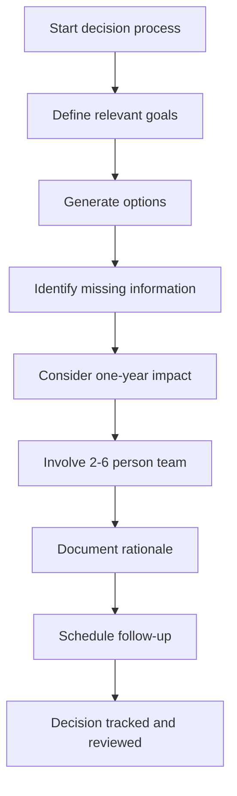
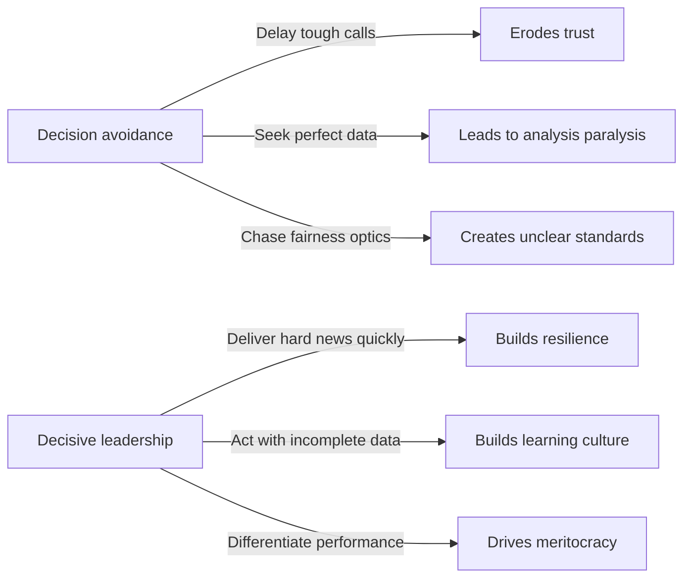
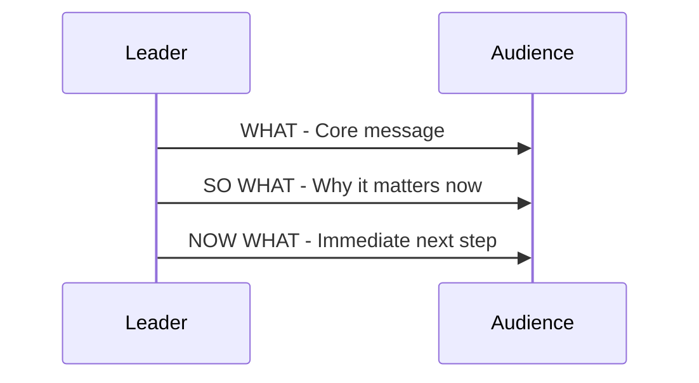
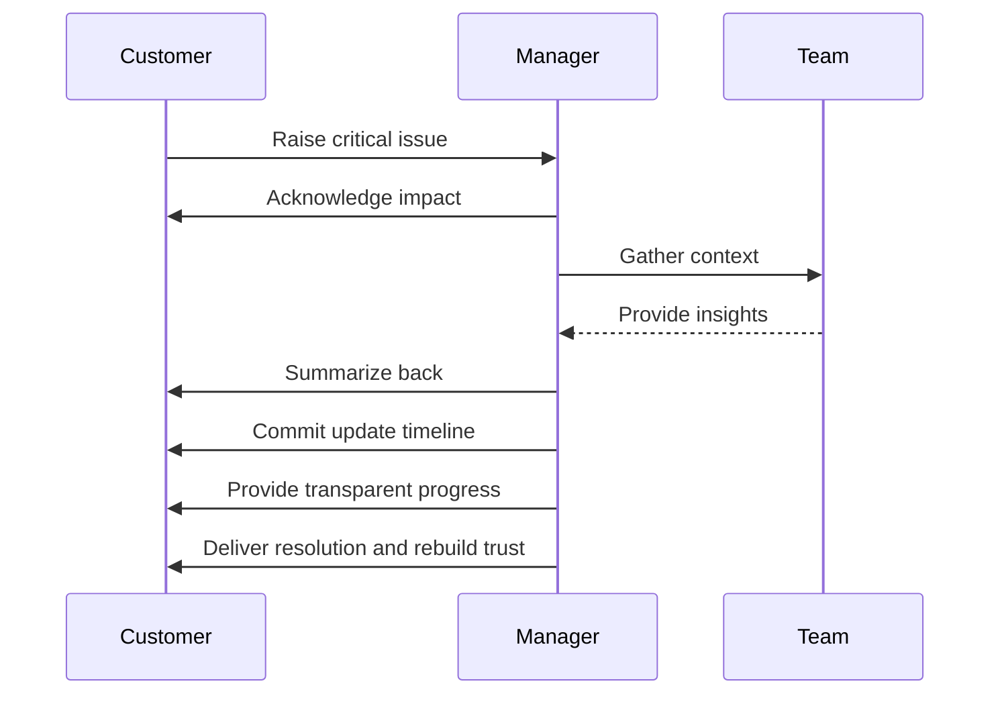
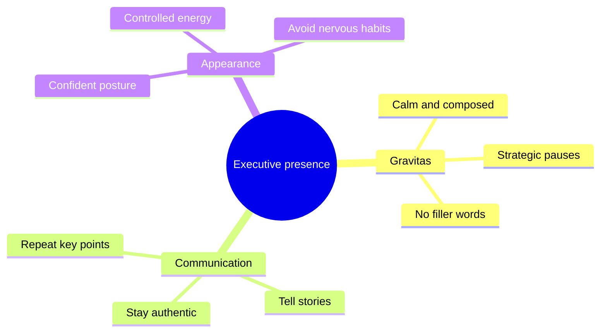

## Leadership and Professional Development

### Managerial Decision Making Checklist

1. Define relevant goals.
2. Generate at least **3-4 realistic alternatives**.
3. Identify missing information.
4. Consider one-year impact.
5. Involve a **small team (2-6 people)**.
6. Document the decision and rationale.
7. Schedule a follow-up.

### Leading by Decisiveness

- Deliver difficult news promptly to build resilience.
- Act with incomplete data and normalize learning from mistakes.
- Differentiate performance to nurture meritocracy.

### Goal Setting and Roadmaps (SMART Examples)

- **Strategic abilities & vision:** Build a 12-18 month technical roadmap within six months; secure 80% stakeholder consensus; invest two hours weekly in research.
- **Leading by example:** Champion code quality, follow standards, perform thorough reviews, target a 15% drop in critical QA bugs, and join at least five code reviews per week.
- **People leadership & communication:** Foster psychological safety, delegate significant tasks with clear expectations, and gather feedback on growth.

### Effective Communication

- Prefer strategic messaging over purely informational updates.
- Structure messages using **BLUF (Bottom Line Up Front):** state the core message (**WHAT**), explain its importance (**SO WHAT**), and clarify the next step (**NOW WHAT**).

### Meeting and Conflict Management

- Open with agendas and notes so attendees arrive prepared.
- Summarize dense information; watch for groupthink and practice active listening.
- Offer context by considering the other person’s perspective ahead of time.

### Managing Customer Issues

1. Acknowledge the issue and pain points.
2. Align internally and schedule the right experts.
3. Listen actively to capture the customer narrative.
4. Summarize back to close the loop.
5. Commit to an update or resolution timeline.
6. Be transparent, own setbacks, and communicate bad news promptly.
7. Rebuild trust by staying engaged and delivering results.

### Executive Presence Essentials

- Gravitas: stay calm, avoid filler words, modulate voice, and leverage strategic pauses.
- Communication: repeat key points, tell stories, connect the dots, and stay authentic.
- Appearance: maintain a composed, energetic posture and curb nervous habits.

### Personal Branding and Career Growth

- Understand your org’s culture and sponsor yourself to leaders.
- Maintain a high say-to-do ratio and volunteer for work aligned with your strengths.
- Keep your brand consistent during both good and difficult times; be an energy giver.
- Remember the motivators behind great work: purpose, autonomy, impact.
