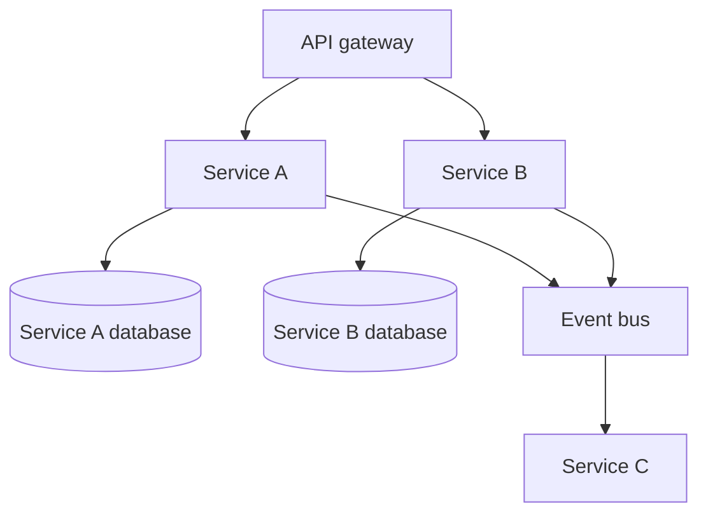
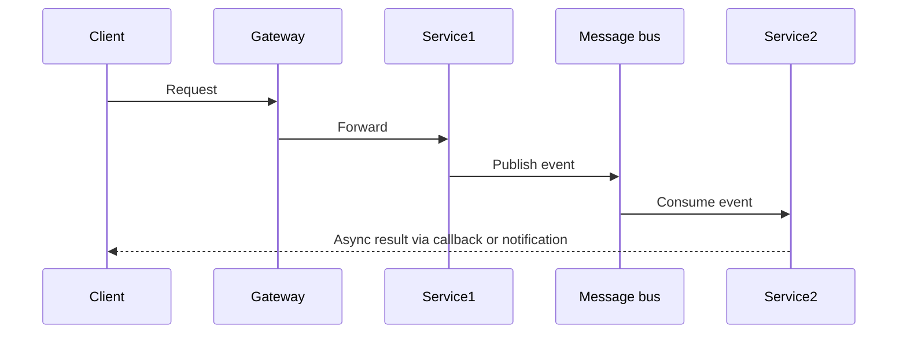

## Microservices Architecture

### Core Principles

- Each service adheres to single responsibility and owns its data.
- Typical layers: application logic, dedicated datastore, API gateway, and event bus.

### Communication Patterns

- Prefer event/message buses for decoupled, resilient interaction.
- Direct HTTP chains risk cascading failures if any service is down.
- Explore CQRS and Event Sourcing for advanced patterns.

### REST Considerations

- POST requests can retrieve data when payloads are complex or must remain private.
- Understand and use appropriate HTTP error codes for robust APIs.
