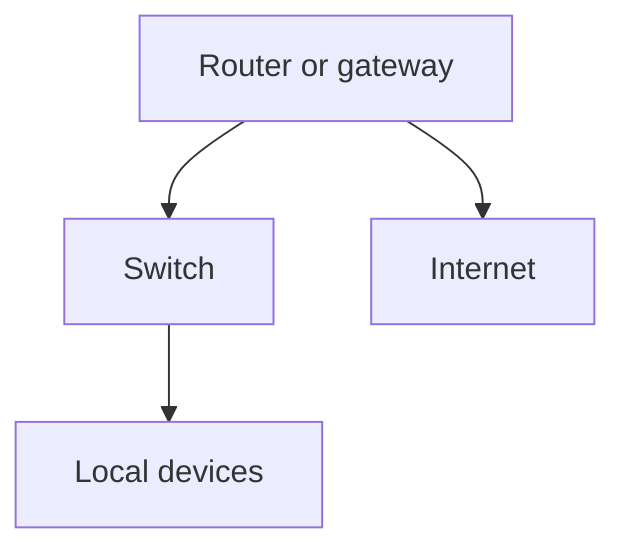
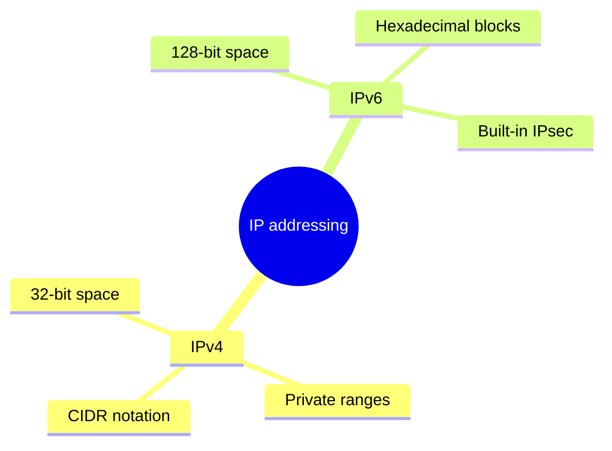
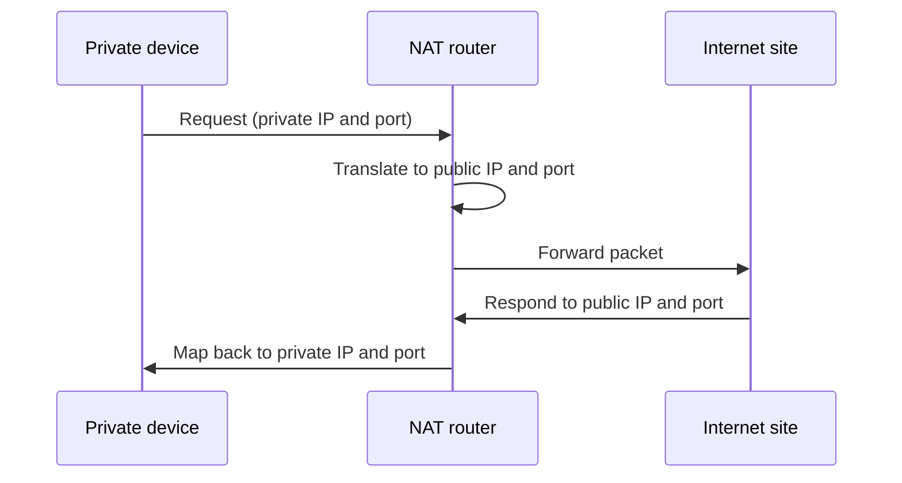
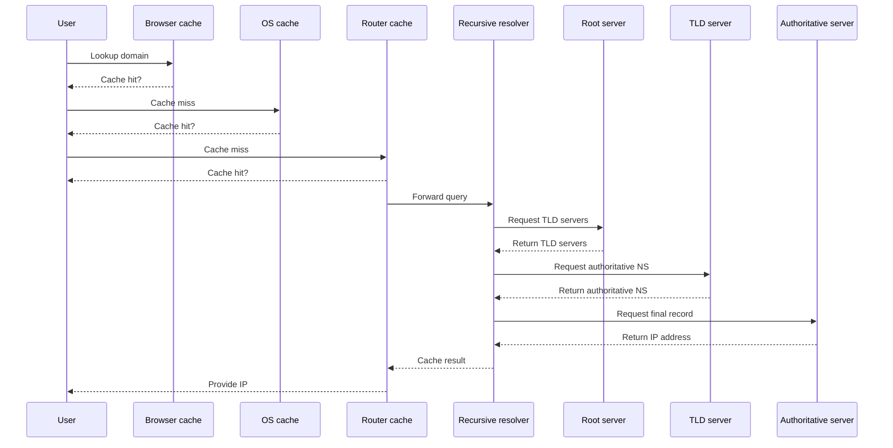
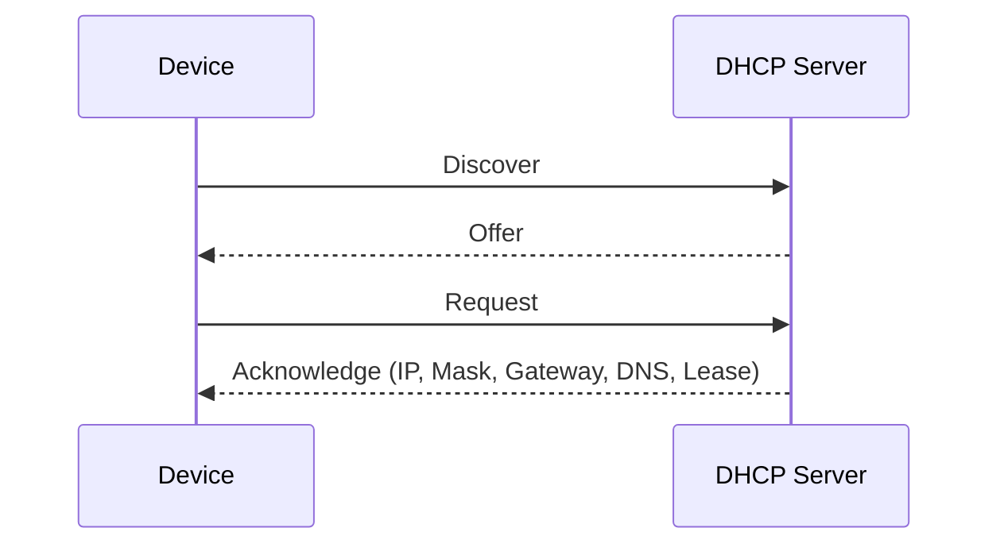

## Networking Concepts

### Devices and Layers

- **Switch:** Connects devices within a network; Layer 2 (MAC-level) focus.
- **Router:** Connects different networks; Layer 3 routing between subnets/VLANs.
- **Default Gateway:** Switch/router address (e.g., `172.16.1.1`).
- **MAC Address:** Physical identifier assigned to a NIC.

### OSI Model Overview

| Layer | Name | Function |
| :--- | :--- | :--- |
| 7 | Application | HTTP/HTTPS, FTP; headers processed |
| 6 | Presentation | Formatting, encryption (HTTPS) |
| 5 | Session | Manages connections (often handled by client libraries) |
| 4 | Transport | Segments data; TCP/UDP |
| 3 | Network | Routes packets with source/destination IPs |
| 2 | Data Link | Frames data; MAC addressing; ARP |
| 1 | Physical | Signals across cables/fiber |

### IP Addressing

- **IPv4:** 32-bit addresses; private ranges include Class A (`10.0.0.0/8`), Class B (`172.16.0.0/12`), Class C (`192.168.0.0/16`).
- **CIDR & Subnets:** `/8` (large), `/24` (256 addresses). Usable host count is `2^(32 - CIDR) - 2`.
- **IPv6:** 128-bit hexadecimal; includes IPsec, autoconfiguration via router advertisement, optional DHCP.

### NAT and ARP

- **ARP:** Broadcast to map IP → MAC within local network; never leaves LAN.
- **NAT:** Router rewrites private IP headers to its public IP, hides internal topology, maintains translation table.

### Mobile Networking & Hotspots

- SIM/eSIM authenticates device to the carrier.
- Hotspot mode mirrors router behavior: runs DHCP, uses NAT for connected clients.
- eSIMs store multiple profiles; modern phones keep two active numbers.

### VPN Fundamentals

- VPN wraps original packets in encrypted tunnels (encapsulation) to a VPN server.
- Server replaces the client’s public IP with its own before forwarding traffic.
- VPNs do not block cookies by default; additional tools are needed.

### DNS Resolution

1. Browser cache → OS cache → router cache.
2. Recursive resolver (e.g., 8.8.8.8) queries root → TLD → authoritative nameserver.
3. Final IP returned and cached for reuse.

- **Record Types:** A (IPv4 address), CNAME (alias). Anycast IPs leverage BGP for shortest route to a shared address.

### DHCP

- **DORA:** Discover → Offer → Request → Acknowledge.
- DHCP issues leases for IP, subnet mask, gateway, DNS.
- **APIPA:** Fallback `169.254.x.x` when DHCP fails; indicates connectivity issue.
- **Reservations:** Bind MAC addresses to specific IPs for predictable assignments.
