## Practical Time Management

### Goal Definition

- Set clear, actionable targets (e.g., "Finish the blog page" instead of "Work on portfolio").
- Keep the end goal visible to resist perfectionist avoidance.

### Distraction Control

- Identify distraction types: internal, external-controllable, external-uncontrollable.
- Work in focused blocks; eliminate controllable distractions during each block.
- Helpful tools: **Cold Turkey** (macOS), **Forest / One Sec** (iOS), **IFTTT** (calendar integrations).

### Prioritization

```mermaid
gantt
    dateFormat  HH:mm
    title Sample focus day
    section Deep work
    TaskA           :09:00, 02:00
    section Recovery
    BreakReview     :11:00, 00:30
    section Collaboration
    SyncDelegation  :11:30, 01:00
    section Deep work
    TaskB           :13:00, 01:30
    section Admin
    LightTasks      :14:30, 00:45
```

- Limit daily focus to at most three major tasks.
- Plan the week by selecting the three outcomes that define success; avoid starting new lists until the weekly goals are done.
- Batch similar tasks to reduce context switching and preserve deep focus.

### Energy Management

- Track energy levels with tools like `welltory` to schedule demanding work when energy peaks.
