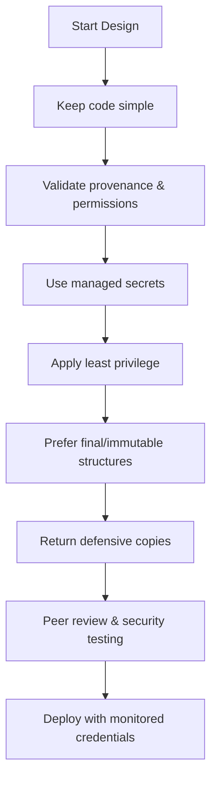

## Secure Coding Practices

### Principles

- **Provenance:** Confirm the actor is legitimate and authorized before executing operations.
- **Simplicity:** "Perfection is not when there is nothing more to add, but when there is nothing more to take away."
- **Least Privilege:** Avoid blanket admin grants; iterate to determine minimum necessary permissions.
- **Credential Hygiene:** Reuse managed credentials; avoid proliferating new secrets.

### Practical Guidelines

- Store secrets in a dedicated secrets manager; API calls should use scoped machine identities, never user credentials or raw passwords.
- Prefer immutable constructs: mark fields `final`, expose defensive copies, and lean toward read-only patterns.
- Treat reflection as unsafe; limit or avoid its use.
- Design with humility—keep code simple, auditable, and secure by default.
