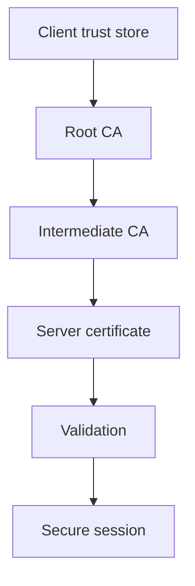
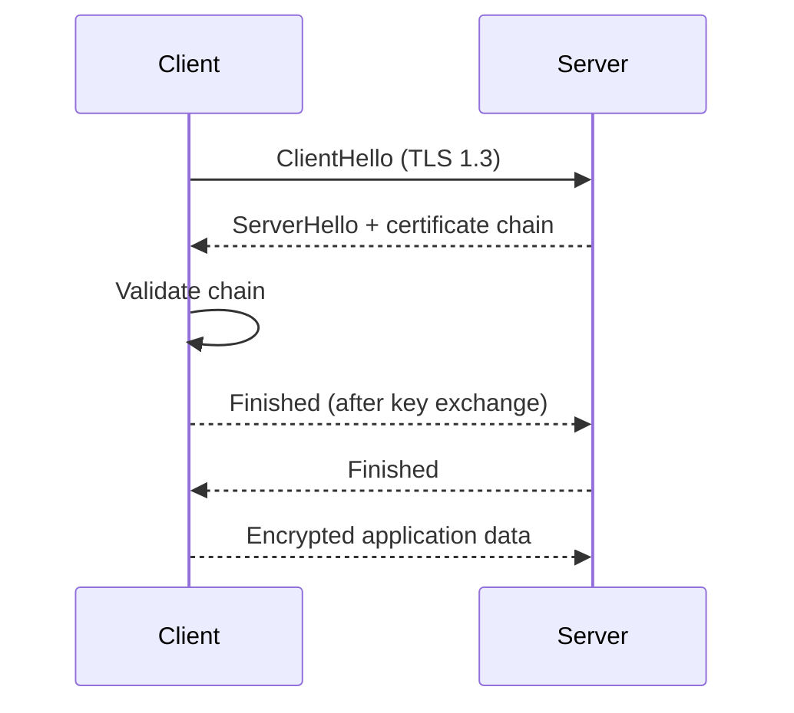

## SSL/TLS Security and Cryptography

### Certificate Fundamentals

- Certificates bind public keys to identities via digital signatures.
- Validation includes checking issuer, signature, validity period, and certificate chain.
- Wildcard certificates (e.g., `*.domain.com`) cover multiple subdomains.

### Chain of Trust

- Root CAs are self-signed and trusted by clients.
- Intermediate CAs bridge root and server certificates; servers must deliver the full chain.
- Invalid or missing links cause clients to reject the certificate.

### Extensions and Usage

- **Key Usage:** `digitalSignature`, `keyEncipherment`, etc.
- **Extended Key Usage:** `TLS Web Server Auth`, etc.
- **Basic Constraints:** `CA:TRUE/FALSE`.
- **Subject Alternative Names (SAN):** Enumerate covered hostnames.

### Best Practices

- Enforce forward secrecy: prefer ephemeral key exchange (ECDHE/DHE); avoid RSA key exchange for session keys.
- Monitor expiration and revocation (OCSP, CRL); update certificates proactively.
- Test configuration with sites like `badssl.com` to ensure proper error handling.
- TLS 1.3 streamlines the handshake, encrypts more data sooner, and mandates PFS.
