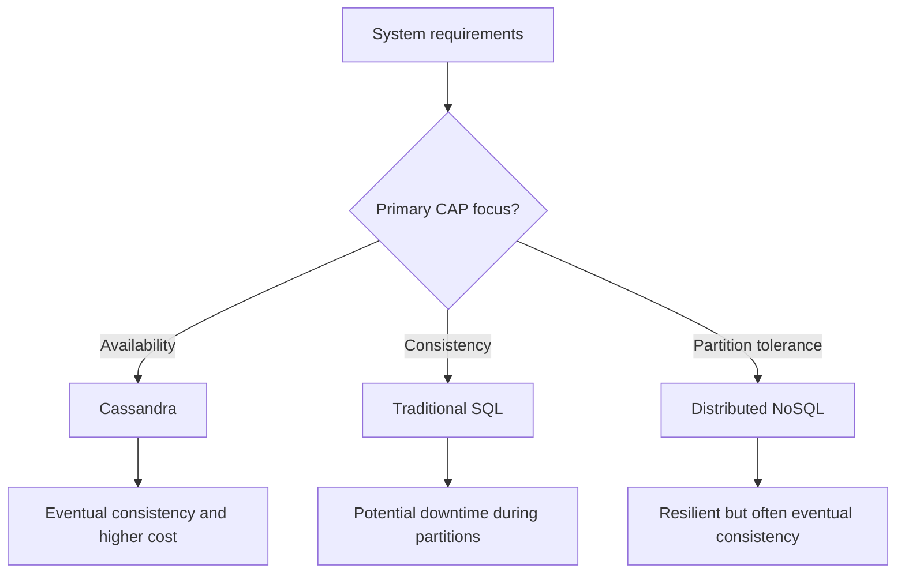
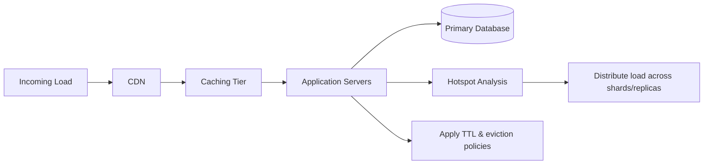
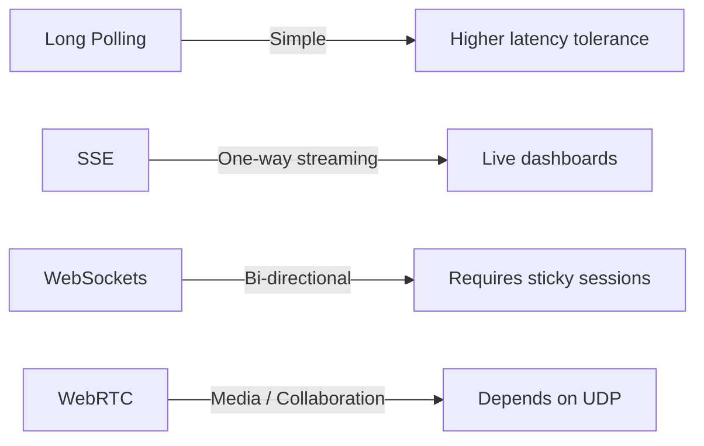

## System Design and Database Scaling

### Database Considerations

- **Cassandra:** Prioritizes availability by allowing any node to act as primary, trading immediate consistency for eventual consistency and higher operational cost.
- **CAP Theorem:** Modern databases often balance consistency, availability, and partition tolerance well, but trade-offs still exist (e.g., MongoDB may momentarily sacrifice availability during primary failover).
- Always clarify which CAP property can be compromised for the workload.

### Performance and Scaling

- Favor off-the-shelf solutions when they solve the problem reliably, but understand the underlying implementation.
- Simulate production load for **cold starts**, handle **hotspots** by spreading traffic, and apply TTLs when appropriate.
- Choose appropriate cache eviction policies: **LRU**, **LFU**, or **FIFO**.
- Use CDNs to offload traffic and improve latency.

### Networking and Protocol Choices

- **UDP:** Unsupported natively by browsers.
- **HTTP:** Provides forward/backward compatibility via headers.
- **GraphQL:** Useful when front-end needs change frequently, reducing backend churn.
- **SSE:** Suited for one-way streaming (e.g., stock tickers).
- **WebSockets:** Enable bi-directional communication but are stateful; reserve for when polling or SSE fall short, ideally at the edge.
- **WebRTC:** Ideal for calls and collaborative editing, generally built on UDP.
