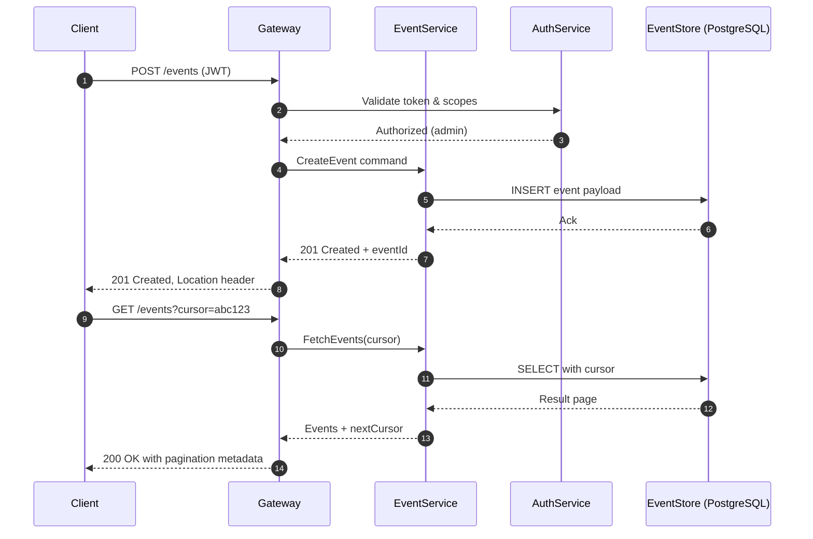
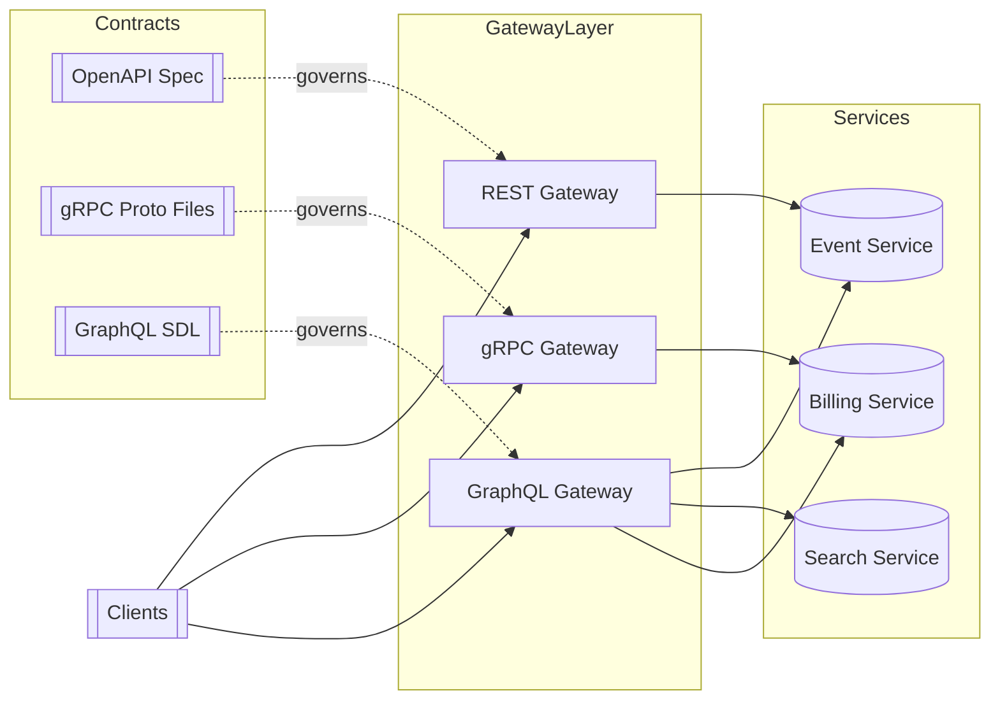

# APIDesign

## Quick Refresh
- Favor resource nouns for REST endpoints (`GET /events`), verbs for commands only when necessary.
- Choose pagination style (page/limit vs cursor) based on consistency and ordering needs.
- Design request/response contracts with clear status codes and error semantics.

## When to Reach For It
- Establishing a public-facing REST API with predictable contracts.
- Aligning microservices on shared standards for endpoints, pagination, and auth.
- Reviewing an existing API for interview scenarios to identify gaps.

## Example Scenario
Building an events service:
- `GET /events?city=NYC&date=2025-10-02` lists events filtered by city and date.
- `POST /events` (requires `@auth:admin`) creates a new event; respond with `201 Created` and the resource location.
- `PATCH /events/{id}` lets organizers update specific fields without overwriting the entire resource.
- Cursor pagination uses response fields like `nextCursor` to maintain ordering during high write volume.

## Visualizations

## Operational Guidance
- Document HTTP methods, expected status codes, and idempotency guarantees in OpenAPI/Swagger specs.
- Mitigate GraphQL N+1 issues with batching (e.g., DataLoader) and field-level caching.
- For RPC between services, define versioned schemas and backward-compatible evolutions.
- Secure endpoints with JWT access tokens, mTLS, or API keys; advertise auth scopes in docs.

## Deepen Your Understanding
- Hello Interview – API Design: https://www.hellointerview.com/learn/system-design/in-a-hurry/apis
- Gaurav Sen – REST API Design Best Practices (2024): https://youtu.be/ZcSR5cX9G3U
- Hussein Nasser – Cursor Pagination Explained: https://youtu.be/v6oPtTh_zPk