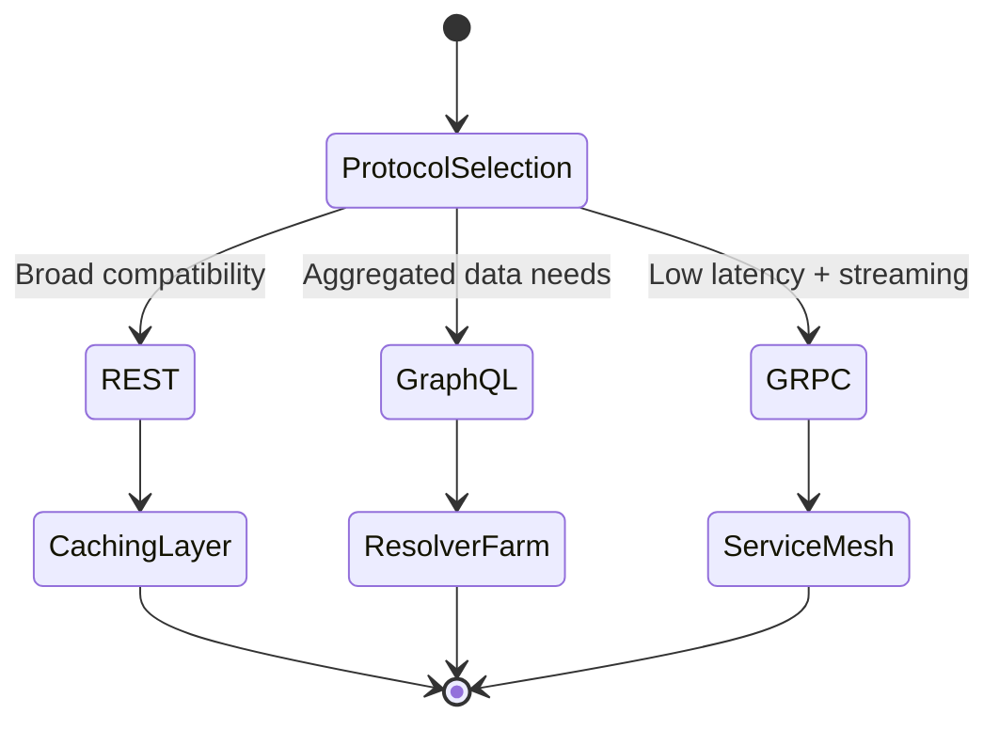

# API Protocols

## Quick Refresh
- REST favors resource-oriented HTTP APIs with simple caching and broad tooling.
- gRPC uses Protocol Buffers over HTTP/2 for compact, low-latency service-to-service calls.
- GraphQL lets clients shape responses, reducing over/under-fetching at the cost of heavier resolvers.

## When to Reach For It
- REST: Public APIs, browser clients, simple CRUD interactions.
- gRPC: Internal microservices, mobile clients with strict latency needs, streaming workflows.
- GraphQL: Complex UIs aggregating many entities, rapidly evolving product requirements.

## Example Scenario
You are building a consumer marketplace:
- Mobile apps talk to backend services via gRPC to minimize payload size.
- Public partner APIs expose REST endpoints for compatibility with existing tooling.
- The web application uses GraphQL to compose listings, seller info, and reviews in a single round trip.

## Visualizations
```mermaid
flowchart TD
    subgraph Clients
        WebApp[[Web App]]
        MobileApp[[Mobile App]]
        Partner[[Partner Integrations]]
    end

    subgraph Protocols
        REST[REST Gateway\n(HTTP/1.1, JSON)]
        GRPC[gRPC Mesh\n(HTTP/2, Protobuf)]
        GraphQL[GraphQL Server\n(Single Endpoint)]
    end

    subgraph Services
        ListingSvc[(Listing Service)]
        PricingSvc[(Pricing Service)]
        ReviewSvc[(Review Service)]
        AnalyticsSvc[(Analytics Service)]
    end

    WebApp --> GraphQL
    MobileApp --> GRPC
    Partner --> REST

    REST --> ListingSvc
    REST --> AnalyticsSvc
    GRPC --> PricingSvc
    GRPC --> ReviewSvc
    GraphQL --> ListingSvc
    GraphQL --> ReviewSvc
```

```mermaid
gantt
dateFormat  X
axisFormat  %L
section Typical Latency (ms)
REST           :done, 0, 120
GraphQL        :active, 0, 150
gRPC           : 0, 20
```





## Operational Guidance
- Document protocol choices per consumer to avoid accidental coupling.
- Provide shared schemas: OpenAPI for REST, `.proto` files for gRPC, SDL for GraphQL.
- Plan caching and rate limiting differently per protocol (HTTP caching for REST, field-level caching for GraphQL, client-side retries for gRPC).
- Monitor latency and payload size; adapt schemas when clients over-fetch.

## Deepen Your Understanding
- Hello Interview – API Design Primer: https://www.hellointerview.com/learn/system-design/in-a-hurry/apis
- System Design Interview (Alex Xu) – REST vs gRPC vs GraphQL (2024): https://youtu.be/jf8Y1G8NbOE
- Hussein Nasser – GraphQL in Practice: https://youtu.be/cy8r7WSuT1I
