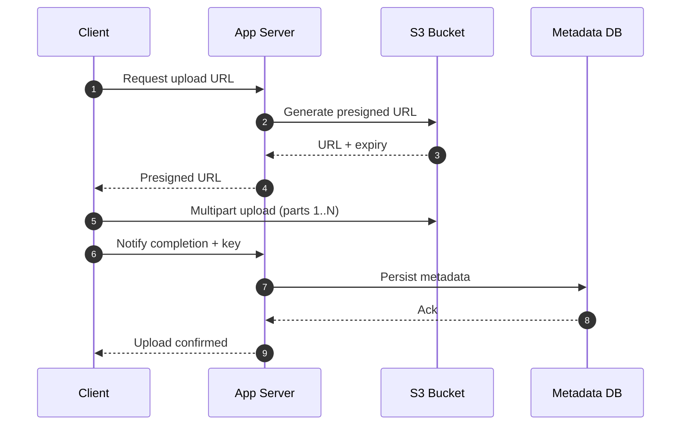
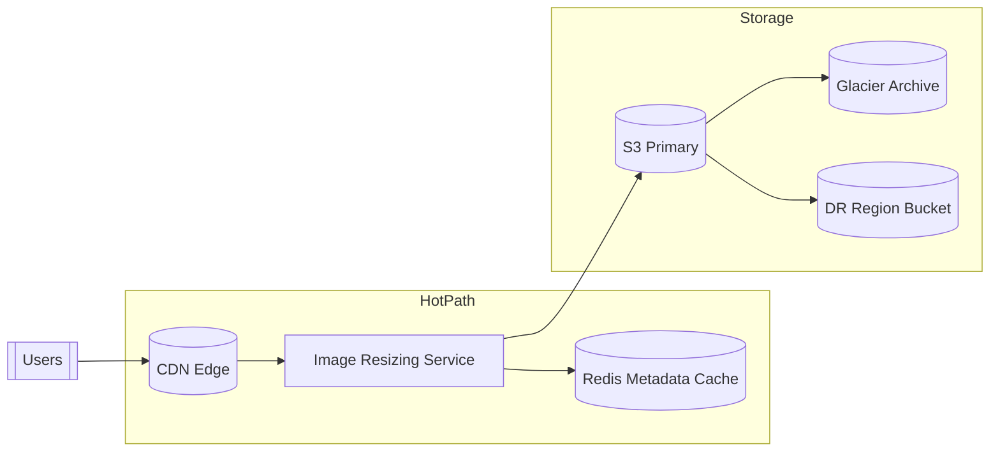
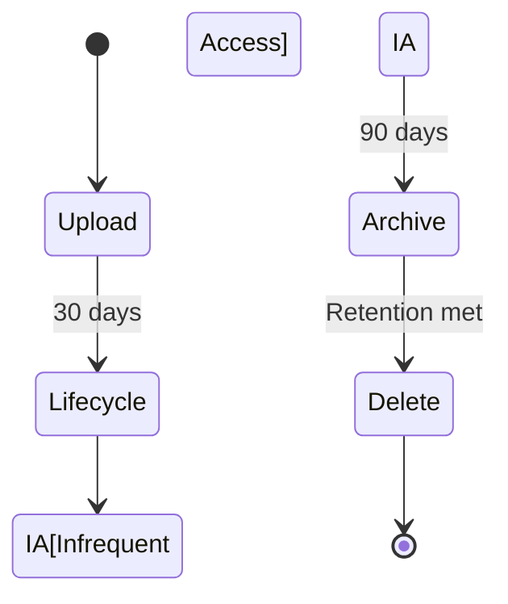

# BlobStorage

## Quick Refresh
- Object storage (S3, GCS, Azure Blob) holds unstructured data with virtually unlimited capacity and high durability.
- Objects are retrieved by key; there is no hierarchical update—uploads replace entire objects or add versions.
- Presigned URLs let clients upload/download directly without routing large payloads through your servers.

## When to Reach For It
- Storing images, videos, machine learning datasets, logs, and backups cheaply at scale.
- Large file ingestion pipelines needing multipart uploads and lifecycle policies.
- Serving static assets via CDN, or sharing data across analytics/batch jobs.

## Example Scenario
Photo-sharing application:
- Mobile clients request presigned upload URLs from the backend, then upload photos straight to object storage.
- Backend stores metadata (user, album, key) in a relational database referencing the blob URL.
- Lifecycle rules move older media to Glacier/Archive tiers after 90 days to reduce costs.

## Visualizations

## Operational Guidance
- Avoid storing large binaries directly in relational databases; offload to object storage for cost and performance.
- Use versioning and replication for durability; enable server-side encryption and IAM policies for security.
- Monitor bandwidth and set up multipart uploads for objects beyond gateway limits (e.g., 5MB chunking in S3).
- Design signed downloader URLs for clients to stream content without hitting your backend.

## Deepen Your Understanding
- Hello Interview – Storage Building Blocks: https://www.hellointerview.com/learn/system-design/in-a-hurry/storage
- AWS re:Invent – Deep Dive on Amazon S3 (2024): https://youtu.be/vVj2wURQqV8
- Gaurav Sen – Object Storage Explained: https://youtu.be/OZDGEmTsA1M