# BloomFilter

## Quick Refresh
- Probabilistic structure to test set membership with no false negatives, tolerating false positives.
- Uses a fixed-size bit array and multiple hash functions to mark presence of elements.
- Excellent for memory-efficient pre-checks before expensive disk or network lookups.

## When to Reach For It
- Check whether a key might exist before hitting a database or cache.
- Prevent duplicate processing in streaming pipelines.
- Filter out obviously absent URLs in a web crawler.

## Example Scenario
URL shortener service with a primary database:
- Incoming requests first consult a Bloom filter to see if a short code might exist.
- If the filter says "not present", skip the database query entirely, saving latency.
- Periodically rebuild or scale the filter when the key space grows beyond projections.

## Visualizations
```mermaid
graph TD
    subgraph Filter
        BitArray[(Bit Array)]
        Hash1[h1]
        Hash2[h2]
        Hash3[h3]
    end

    Incoming[Insert "abc123"] --> Hash1
    Incoming --> Hash2
    Incoming --> Hash3

    Hash1 --> BitArray
    Hash2 --> BitArray
    Hash3 --> BitArray
```

```mermaid
graph TD
    Check[Query "xyz789"] --> H1[h1]
    Check --> H2[h2]
    Check --> H3[h3]

    H1 --> BitPos1[(Bit i = 1?)]
    H2 --> BitPos2[(Bit j = 1?)]
    H3 --> BitPos3[(Bit k = 1?)]

    BitPos1 --> Decision{All bits = 1?}
    BitPos2 --> Decision
    BitPos3 --> Decision

    Decision -->|No| Miss[Definitely Not Present]
    Decision -->|Yes| Maybe[Probably Present]
```



```mermaid
gantt
dateFormat  X
axisFormat  %L
section False Positive Rate
1% FP (m=10n, k=7) :done, 0, 10
0.1% FP (m=15n, k=10) :active, 0, 15
0.01% FP (m=20n, k=14) : 0, 20
```

## Operational Guidance
- Size the bit array (m) and number of hash functions (k) based on expected items (n) using `m = - (n * ln p) / (ln 2)^2`.
- Bloom filters are append-only; consider counting or scalable variants if you must support deletes.
- Monitor false-positive rates; if they exceed thresholds, rebuild with more bits or additional filters.
- Keep hash functions independent (derive from Murmur3, FNV) to avoid correlated collisions.

## Deepen Your Understanding
- Hello Interview – Probabilistic Data Structures: https://www.hellointerview.com/learn/system-design/probabilistic-data-structures
- Gaurav Sen – Bloom Filters Explained (2023): https://youtu.be/uQVRwpGE6R8
- ByteByteGo – Bloom Filters in Distributed Systems: https://youtu.be/YkqbR-OCW2s
