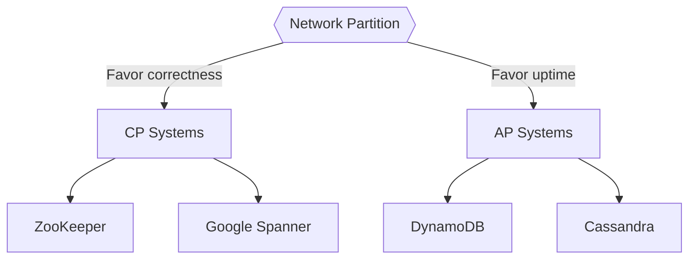
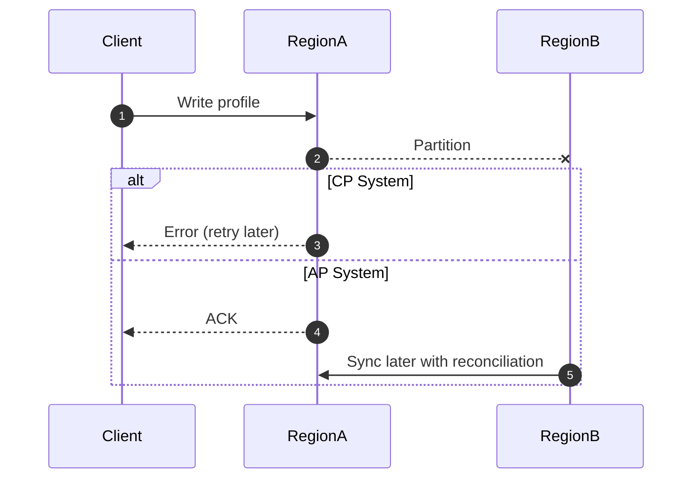

# CAPTheorem

## Quick Refresh
- A distributed system cannot simultaneously guarantee Consistency, Availability, and Partition tolerance.
- During a network partition, you must choose to prioritize either Consistency (CP) or Availability (AP).
- Partition tolerance is non-negotiable for distributed systems; failures and splits will happen.

## When to Reach For It
- Deciding between strongly consistent databases (e.g., etcd) vs. eventually consistent stores (e.g., DynamoDB).
- Explaining trade-offs in interview discussions about availability vs correctness.
- Designing multi-region architectures where partitions are more common.

## Example Scenario
Global user profile service:
- CP choice (e.g., Zookeeper-backed store) ensures users always see the latest profile, but writes fail for isolated regions during partitions.
- AP choice (e.g., Dynamo-style store) lets users update profiles even when regions are partitioned, but conflicts must be reconciled later.

## Visualizations


```mermaid
matrix
  title CAP vs PACELC
  columns Consistency Availability Latency
  row CP  "✔" "✖" "Higher"
  row AP  "✖" "✔" "Lower"
  row PACELC_CP  "✔" "✖" "Higher (even without partition)"
  row PACELC_AP  "Eventual" "✔" "Lower"
```



## Operational Guidance
- Clearly document the consistency model and communicate it to application developers.
- For AP systems, implement conflict resolution (vector clocks, last-write-wins, CRDTs).
- For CP systems, plan for lower uptime under partitions and provide retry guidance to clients.
- Use CAP alongside PACELC (latency vs consistency when no partition) for richer decision making.

## Deepen Your Understanding
- Hello Interview – CAP Theorem Primer: https://www.hellointerview.com/learn/system-design/in-a-hurry/cap-theorem
- Gaurav Sen – CAP Theorem Explained (2024): https://youtu.be/3v9T1N3b0gw
- System Design Interview – PACELC Illustrated: https://youtu.be/n0lxvuw1F1M
