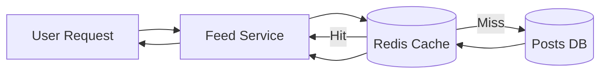

# Caching

## Quick Refresh
- Stores hot data closer to the consumer to reduce latency and load on origin systems.
- Placement layers: client/browser cache, CDN edge, application tier (Redis/Memcached), database cache.
- Eviction and invalidation strategies determine freshness vs. performance trade-offs.

## When to Reach For It
- Read-heavy workloads where data changes infrequently.
- Expensive computations (e.g., personalization) that can be reused.
- Smooth out load spikes and reduce database query volume.

## Example Scenario
Social feed service:
- Feed entries fetched from the database are cached in Redis with a TTL of 60 seconds.
- On cache miss, the service rebuilds the feed, stores it, and returns the result.
- Invalidation occurs when a user posts new content—publish/subscribe alerts cache nodes to evict the user’s feed entry.

## Visualization

## Operational Guidance
- Choose eviction policies (LRU, LFU, FIFO) aligned with access patterns.
- Guard against cache stampede with request coalescing, stale-while-revalidate, or jittered TTLs.
- For write-heavy data, consider write-through or write-back strategies and monitor replication lag.
- Instrument hit/miss ratios and latency to validate effectiveness; adjust TTLs as behavior shifts.

## Deepen Your Understanding
- Hello Interview – Caching Strategies: https://www.hellointerview.com/learn/system-design/in-a-hurry/caching
- Gaurav Sen – Cache Design: https://youtu.be/iuqZvajTOyA
- ByteByteGo – Cache Invalidation Patterns: https://youtu.be/uC4nZ8OK3Ks
