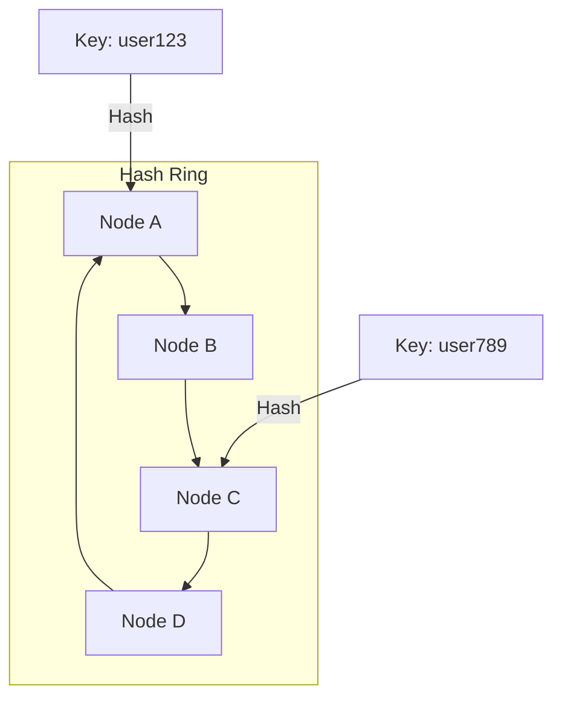

# ConsistentHashing

## Quick Refresh
- Distributes keys across nodes with minimal reshuffling when nodes join or leave.
- Maps both nodes and data keys onto a virtual ring, assigning each key to the next clockwise node.
- Virtual nodes smooth load distribution by giving each physical node multiple positions on the ring.

## When to Reach For It
- Scaling distributed caches (Memcached, Redis) without rewriting all keys.
- Load balancing requests with sticky routing for session affinity.
- Sharding databases or object stores where node churn should not trigger mass migrations.

## Example Scenario
Distributed cache cluster:
- Each client hashes user IDs onto a ring and routes to the associated cache node.
- Adding a new node only reallocates keys between its neighbors instead of the entire keyspace.
- Virtual nodes (e.g., 100 per server) prevent hotspots when one physical node has disproportionate responsibility.

## Visualization

## Operational Guidance
- Use stable, consistent hash functions (MD5, SHA-1) and ensure all clients share the same ring configuration.
- Store configuration in a coordination service (Zookeeper, etcd) for dynamic updates.
- Replicate keys across multiple consecutive nodes to improve availability.
- Monitor per-node load; adjust virtual node counts if a physical node becomes a hotspot.

## Deepen Your Understanding
- Hello Interview – Consistent Hashing: https://www.hellointerview.com/learn/system-design/consistent-hashing
- Gaurav Sen – Consistent Hashing Explained: https://youtu.be/k6Il1Dw8x5o
- ByteByteGo – Consistent Hashing Visualized: https://youtu.be/vHXLBJ4T8dE