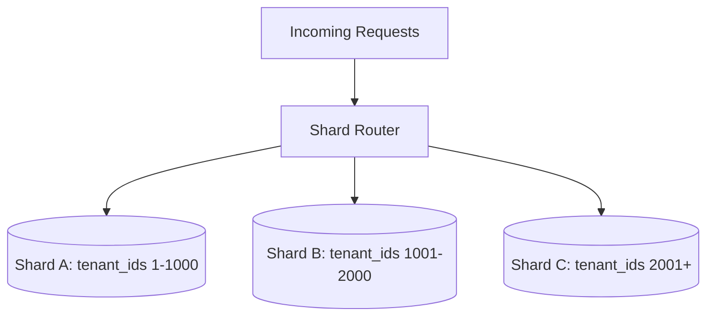

# DataPartitioning

## Quick Refresh
- Horizontal sharding spreads rows across nodes using a shard key; vertical partitioning splits columns/services.
- Goals: scale storage and throughput, improve locality, isolate faults.
- Key challenge: picking shard keys that distribute load evenly and keep related data together.

## When to Reach For It
- Dataset no longer fits on a single node or exceeds I/O limits.
- Multi-region deployments requiring data locality (GDPR, latency-sensitive traffic).
- Hotspot tables where a subset of keys dominate traffic.

## Example Scenario
Multi-tenant SaaS application:
- Shard customer data by `tenant_id` to ensure each customer’s data resides on a single shard.
- Large tenants get dedicated shards; smaller ones share pooled shards.
- Vertical partitioning separates audit logs into their own service optimized for write-heavy workloads.

## Visualization

## Operational Guidance
- Choose shard keys with uniform distribution; avoid monotonically increasing keys that overload a single shard.
- Implement routing via consistent hashing or lookup tables; cache routing metadata client-side when possible.
- Automate rebalancing: split and merge shards as tenants grow, with minimal downtime.
- Provide cross-shard query abilities via federated queries or asynchronous aggregation pipelines.

## Deepen Your Understanding
- Hello Interview – Sharding: https://www.hellointerview.com/learn/system-design/sharding
- Gaurav Sen – Sharding & Partitioning: https://youtu.be/W5Z69_01Gc8
- ByteByteGo – Data Partitioning Explained: https://youtu.be/kaVFY6ZD04w
