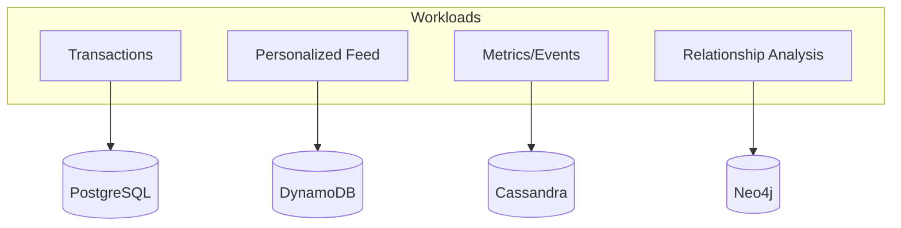

# DatabaseModels

## Quick Refresh
- Relational databases excel at structured data with ACID guarantees; start here unless requirements dictate otherwise.
- NoSQL families—key-value, document, wide-column, graph—optimize for specific access patterns, scale, or flexibility.
- Schema design should align with query patterns, consistency needs, and growth expectations.

## When to Reach For It
- Relational (PostgreSQL/MySQL): Strong consistency, complex joins, transactional workloads.
- Document (MongoDB, DynamoDB): Evolving schema, JSON-centric APIs, hierarchical data.
- Wide-column (Cassandra, Bigtable): Time-series, IoT, massive writes with tunable consistency.
- Graph (Neo4j): Relationship-centric queries (recommendations, fraud graphs).

## Example Scenario
Social networking platform:
- Core profile and relationships stored in PostgreSQL for transactional integrity.
- Activity feed denormalized into a document store for fast aggregation per user.
- Analytics pipeline writes engagement metrics to a wide-column database for efficient time-series queries.

## Visualization

## Operational Guidance
- Start normalized; denormalize only when query hotspots remain after adding indexes.
- Use change-data-capture or event streams to keep multiple datastores in sync.
- Model sharding keys around common queries (e.g., partition comments by `post_id`).
- Plan schema migrations carefully: version APIs, run dual writes, or leverage feature flags.

## Deepen Your Understanding
- Hello Interview – Storage Patterns: https://www.hellointerview.com/learn/system-design/in-a-hurry/storage
- Gaurav Sen – Choosing Databases: https://youtu.be/h4NGQ_jwl-Y
- ByteByteGo – SQL vs NoSQL: https://youtu.be/ZS_kXvOeQ5Y