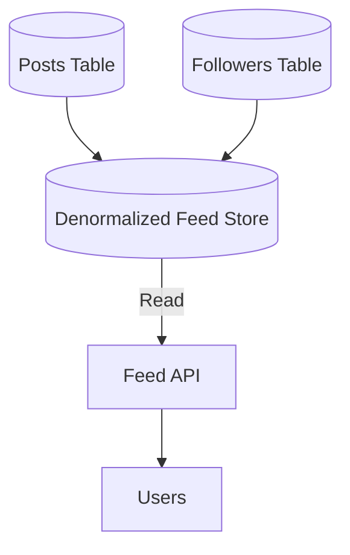

# Denormalization

## Quick Refresh
- Duplicates data across tables/documents to eliminate joins and accelerate reads.
- Best for read-heavy systems where latency is critical and storage is inexpensive.
- Requires careful synchronization to avoid data drift between copies.

## When to Reach For It
- Materializing aggregates (e.g., follower counts) to reduce expensive queries.
- Serving prejoined data to power API responses or search indexes.
- Offline analytics pipelines that consolidate data warehouses for BI consumption.

## Example Scenario
News feed service:
- Store each user’s feed as a denormalized document containing post metadata for quick retrieval.
- When a user posts, background jobs fan out updates to followers’ feed documents.
- A nightly job reconciles discrepancies by comparing canonical data with denormalized copies.

## Visualization

## Operational Guidance
- Track ownership per field to manage updates—use CDC or event sourcing to trigger rebuilds.
- Establish SLAs for eventual consistency; communicate expected staleness to consumers.
- Validate denormalized data regularly; build repair scripts for drift.
- Document fallback strategies when write fan-out fails (e.g., rebuild feed on demand).

## Deepen Your Understanding
- Hello Interview – Denormalization Tactics: https://www.hellointerview.com/learn/system-design/in-a-hurry/denormalization
- Gaurav Sen – Feed Denormalization: https://youtu.be/sv6W_QRV-NE
- ByteByteGo – Data Modeling Trade-offs: https://youtu.be/F-9KcJolqC8
