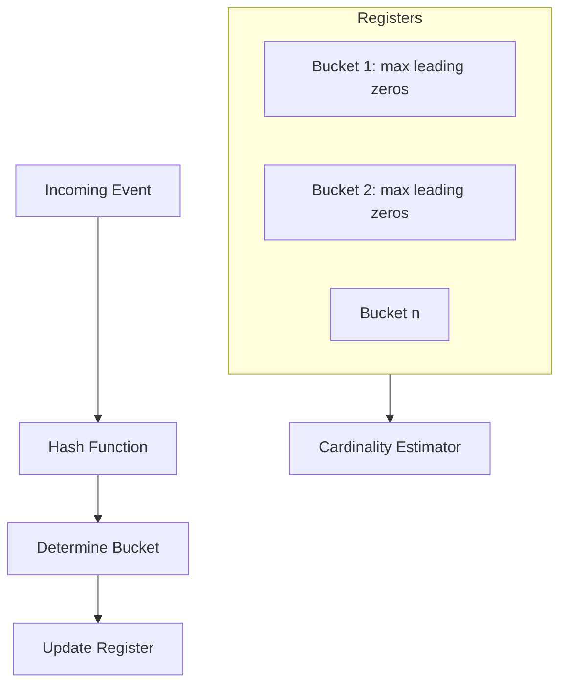

# HyperLogLog

## Quick Refresh
- Estimates cardinality (unique element count) with fixed, small memory footprint.
- Uses hashed elements to update registers keyed by leading zero counts; accuracy ~1.6% with 12KB state.
- Mergeable across shards: take max of corresponding registers to combine counts.

## When to Reach For It
- Real-time analytics dashboards counting unique users, sessions, or events.
- Large-scale logging pipelines where exact distinct counts are too expensive.
- Quickly estimate set size before running costly deduplication jobs.

## Example Scenario
Ad analytics platform:
- Each shard maintains a HyperLogLog per campaign to count unique viewers.
- Periodic jobs merge shard-level sketches to produce global counts for billing.
- For small campaigns, fall back to exact counts to avoid high relative error.

## Visualization

## Operational Guidance
- Tune bucket count `m = 2^b`; higher m reduces error but increases memory.
- Use sparse representations for low cardinalities to maintain accuracy.
- Validate error bounds in staging; compare with ground truth to calibrate.
- For deletions or windowed counts, maintain multiple sketches per timeframe or use sliding windows.

## Deepen Your Understanding
- Hello Interview – Probabilistic Counting: https://www.hellointerview.com/learn/system-design/probabilistic-data-structures
- Gaurav Sen – HyperLogLog Explained: https://youtu.be/4Z7T5k4iMNE
- ByteByteGo – Counting Distinct at Scale: https://youtu.be/sx4mA4FoK0w
