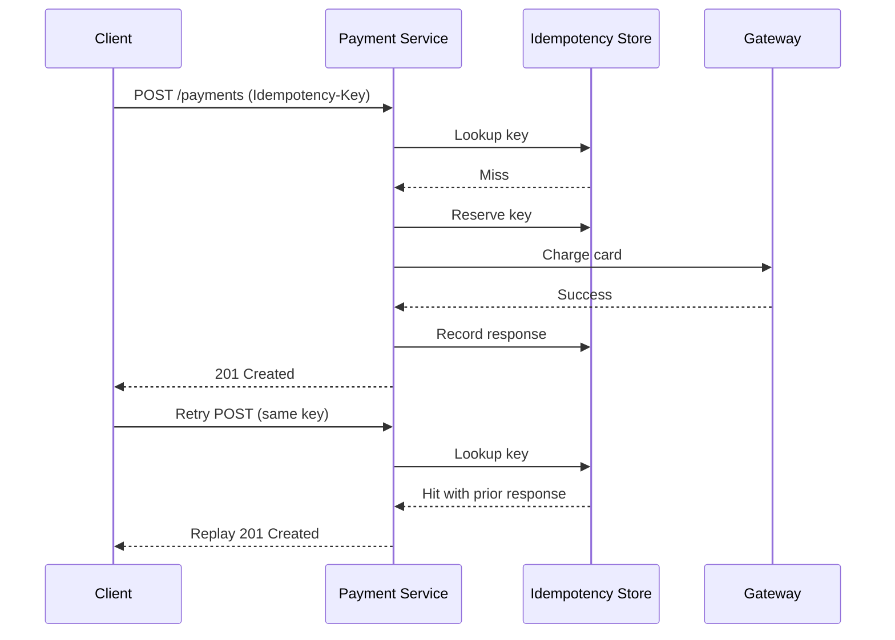

# Idempotency

## Quick Refresh
- An operation is idempotent if repeating it yields the same result as running it once.
- Essential for retries in distributed systems where network failures or duplicates occur.
- Typically implemented with unique request identifiers and deduplication stores.

## When to Reach For It
- Payment processing, order creation, and other financial transactions.
- External webhooks or client retries where duplicate requests are likely.
- Background jobs reprocessing messages after failures.

## Example Scenario
Checkout service:
- Client sends `POST /payments` with an `Idempotency-Key` header.
- Service checks a datastore for the key; if present, returns the previous response.
- If not present, process the payment, persist the result keyed by the idempotency token, then respond.

## Visualization

## Operational Guidance
- Decide how long to retain idempotency records (minutes to hours) based on retry policies.
- Ensure datastore writes are atomic to avoid race conditions (transactions or conditional updates).
- Use request hashing for large payloads; store minimal metadata (status, response body, timestamp).
- Communicate idempotency expectations in API docs; specify which endpoints support it.

## Deepen Your Understanding
- Hello Interview – Reliability Patterns: https://www.hellointerview.com/learn/system-design/reliability
- Gaurav Sen – Idempotent APIs: https://youtu.be/6-q0QDnI5Hw
- Stripe Engineering – Designing Idempotent APIs: https://stripe.com/blog/idempotency
