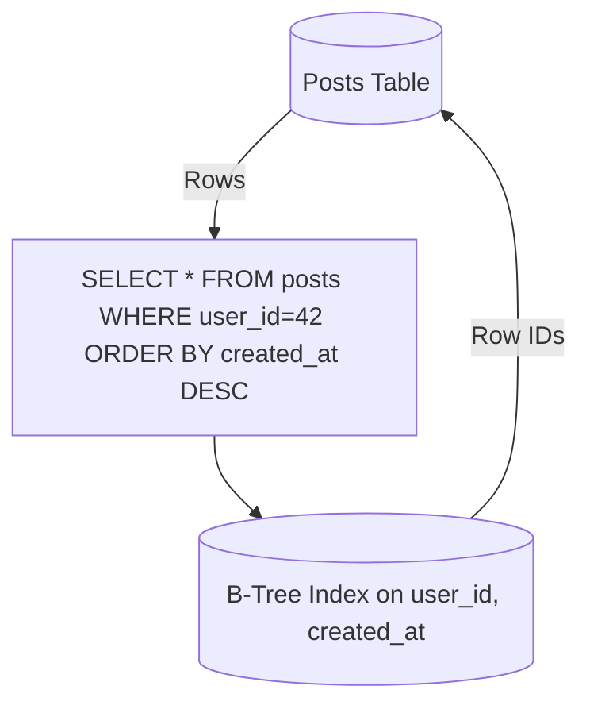

# Indexing

## Quick Refresh
- Indexes create auxiliary data structures to accelerate lookups at the cost of extra writes and storage.
- B-tree indexes dominate for range queries; hash indexes handle exact matches but lack ordering.
- Specialized indexes (geospatial, full-text) optimize for domain-specific queries.

## When to Reach For It
- Hot queries filtering or sorting on specific columns.
- JOIN operations needing fast lookups on foreign keys.
- Text search (use inverted indexes) or geospatial queries (R-trees, Quadtrees).

## Example Scenario
Photo-sharing app:
- `posts` table indexed on `user_id` for rapid fetch of a user’s timeline.
- Composite index `(user_id, created_at DESC)` supports pagination ordered by time.
- Full-text inverted index on captions enables keyword search; geospatial index on photo locations powers "nearby photos" feature.

## Visualization

## Operational Guidance
- Keep indexes lean: include only necessary columns; avoid over-indexing to prevent write amplification.
- Monitor usage (`pg_stat_user_indexes`, `SHOW INDEX`) to identify unused or bloated indexes.
- Rebuild or reindex periodically if fragmentation grows, especially for high-churn tables.
- For multi-range queries (geo, text), adopt specialized indexes instead of contorting B-trees.

## Deepen Your Understanding
- Hello Interview – Indexing Primer: https://www.hellointerview.com/learn/system-design/in-a-hurry/indexing
- Gaurav Sen – Database Indexing: https://youtu.be/pvEExDxdvYo
- Hussein Nasser – B-Tree vs Hash Index: https://youtu.be/qP2Sk_Ni58k