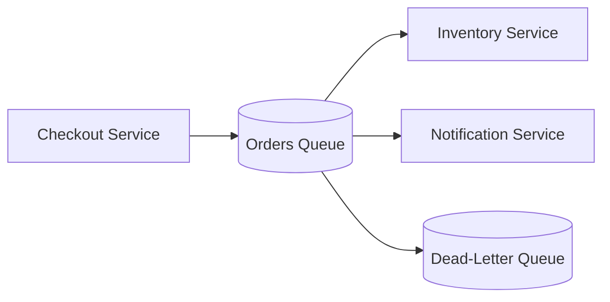

# MessageQueues

## Quick Refresh
- Decouple producers and consumers using durable queues that buffer messages until processed.
- Smooth traffic spikes, allow asynchronous processing, and improve reliability via retries.
- Patterns include work queues, pub/sub topics, and delayed queues.

## When to Reach For It
- Microservices communication where downstream services must not be overwhelmed.
- Background task execution (email sending, video encoding, invoice generation).
- Event-driven architectures broadcasting state changes to many subscribers.

## Example Scenario
Order processing pipeline:
- Checkout service publishes `OrderPlaced` events to a queue.
- Inventory and notification services consume at their own pace, acknowledging success.
- A dead-letter queue captures messages that repeatedly fail for manual inspection.

## Visualization

## Operational Guidance
- Configure visibility timeouts and retry policies to avoid duplicate processing.
- Monitor queue depth and consumer lag; scale consumers when backlog grows.
- Use idempotent consumers so retries do not cause double side effects.
- Partition topics/queues for high throughput; leverage FIFO queues when ordering matters.

## Deepen Your Understanding
- Hello Interview – Messaging Patterns: https://www.hellointerview.com/learn/system-design/message-queues
- Gaurav Sen – Message Queue Design: https://youtu.be/qkh9sS3U5aY
- ByteByteGo – Event-Driven Architectures: https://youtu.be/LaJDEoMRXAE
