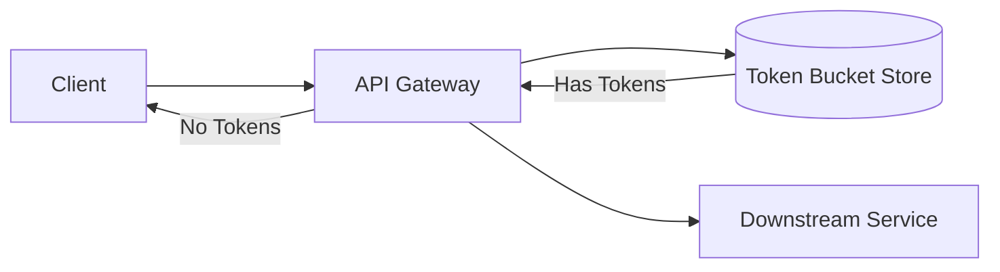

# RateLimiting

## Quick Refresh
- Throttles client requests to protect services from overload or abuse.
- Algorithms: Fixed Window, Sliding Window, Token Bucket, Leaky Bucket.
- Usually enforced at gateways or edge services with distributed counters.

## When to Reach For It
- Public APIs charging per usage tier.
- Preventing brute-force attacks or noisy neighbors in multi-tenant systems.
- Ensuring downstream systems (like databases) stay within safe load limits.

## Example Scenario
Public API platform:
- Token bucket grants 100 requests/minute for basic users, 1000 for premium.
- Requests consume tokens; bucket refills every minute based on rate.
- A shared Redis cluster tracks counters; when tokens are exhausted, gateway returns `429 Too Many Requests` with retry hints.

## Visualization

## Operational Guidance
- Identify rate-limiting keys (user ID, API key, IP) aligning with fairness expectations.
- Use jittered refill intervals or sliding windows to avoid synchronized bursts.
- Provide informative error payloads with reset timestamps; log violations for analysis.
- For distributed deployments, leverage centralized stores (Redis, DynamoDB) or per-pop caches with eventual consistency.

## Deepen Your Understanding
- Hello Interview – Rate Limiting: https://www.hellointerview.com/learn/system-design/rate-limiting
- Gaurav Sen – Designing Rate Limiters: https://youtu.be/dr3YbgduZ7g
- ByteByteGo – Token Bucket Explained: https://youtu.be/o5wJkJJpKtM
