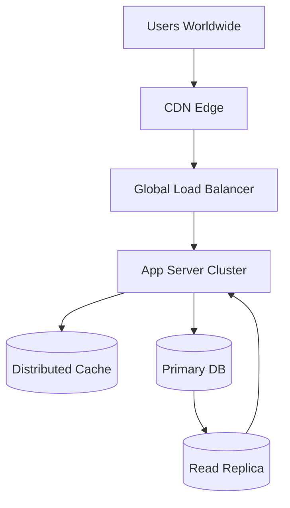

# Scalability

## Quick Refresh
- Vertical scaling adds resources to a single node; horizontal scaling adds more nodes behind a load balancer.
- Databases achieve availability via replicas and standbys: cold, warm, hot, or multi-primary.
- Scaling plans must pair compute growth with data partitioning and caching strategies.

## When to Reach For It
- Traffic or data growth outpaces a single server’s capacity.
- High availability SLAs require failover and redundancy.
- You need to deploy globally to reduce latency for far-flung users.

## Example Scenario
Streaming platform:
- Stateless API servers autoscale based on CPU and queue depth metrics.
- Primary database replicates to hot standbys across regions; read traffic served from replicas.
- Sharded object storage stores user uploads; CDN handles global delivery.

## Visualization

## Operational Guidance
- Monitor saturation metrics (CPU, memory, connection pools) to trigger scale events early.
- Automate failover runbooks; regularly test disaster recovery and replica promotion.
- Balance CAP considerations: synchronous writes for consistency vs. async replication for availability.
- Employ capacity planning: forecast peak load, maintain headroom, and scale load tests accordingly.

## Deepen Your Understanding
- Hello Interview – Scaling Strategies: https://www.hellointerview.com/learn/system-design/scalability
- Gaurav Sen – Horizontal vs Vertical Scaling: https://youtu.be/nlj2sydPb0g
- ByteByteGo – High Availability Architectures: https://youtu.be/DU5lm7aSdsU
