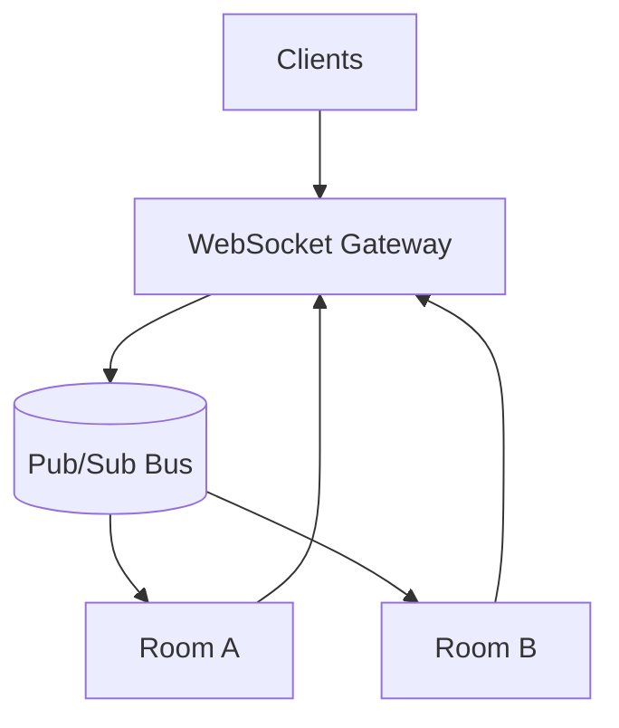

# WebSockets

## Quick Refresh
- Persistent, bidirectional TCP channel upgraded from HTTP, enabling real-time communication.
- Replaces polling for use cases requiring low-latency updates (chat, trading, collaboration).
- Requires connection state management, heartbeats, and graceful fallbacks.

## When to Reach For It
- Chat/messaging apps with real-time delivery expectations.
- Live dashboards, multiplayer games, collaborative editors.
- IoT telemetry streams requiring push updates from devices.

## Example Scenario
Collaborative whiteboard application:
- Clients connect to a WebSocket gateway that authenticates and joins them to rooms.
- Drawing events broadcast to other participants in the room via pub/sub.
- Heartbeat messages detect idle connections; stale sessions are closed gracefully.

## Visualization

## Operational Guidance
- Scale horizontally by externalizing session state (Redis, message queues) so any node can publish updates.
- Implement backpressure: throttle or drop messages when clients cannot keep up.
- Provide fallbacks (Server-Sent Events, long polling) for legacy clients or corporate firewalls.
- Monitor connection counts, message latency, and dropped frames; auto-reconnect clients with jitter.

## Deepen Your Understanding
- Hello Interview – Real-time Systems: https://www.hellointerview.com/learn/system-design/real-time
- Gaurav Sen – WebSockets Architecture: https://youtu.be/6zE-HhXc-Fo
- Ably Engineering – Scaling WebSocket APIs: https://youtu.be/ZwYio5JCwFs
