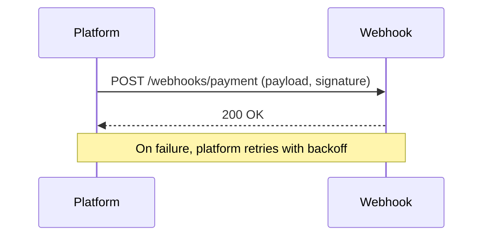

# Webhooks

## Quick Refresh
- Event producers send HTTP callbacks to consumer endpoints when triggers fire.
- Enables push-based integrations without polling; consumers acknowledge and handle retries.
- Requires authentication, idempotency, and monitoring to ensure reliable delivery.

## When to Reach For It
- Integrating third-party systems (payment providers, CRM) with your application.
- Sending real-time notifications (order status, CI/CD events) to customer systems.
- Extending platform functionality via user-defined callbacks.

## Example Scenario
Payment platform:
- Merchant registers a webhook endpoint to receive `payment.succeeded` events.
- On event, the platform posts JSON payloads with signature headers.
- Merchant verifies signature, processes the update, and responds with 200; failures trigger exponential backoff retries.

## Visualization

## Operational Guidance
- Sign payloads (HMAC/SHA256) or use mutual TLS to authenticate the sender.
- Implement retries with exponential backoff and dead-letter queues for persistent failures.
- Provide idempotency keys so consumers can safely handle duplicate deliveries.
- Offer monitoring tools (delivery logs, replay endpoints) to debug integration issues.

## Deepen Your Understanding
- Hello Interview – Integration Patterns: https://www.hellointerview.com/learn/system-design/webhooks
- Gaurav Sen – Webhooks Explained: https://youtu.be/_Ww8EmHzdfA
- Stripe – Building Reliable Webhooks: https://youtu.be/8vF6X_Tthkk
